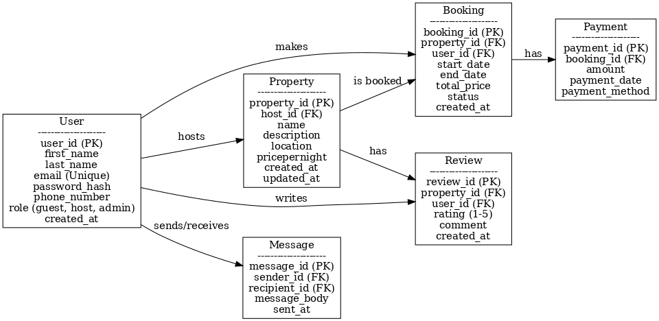

# Airbnb Database ER Diagram

## Entities and Attributes
- **User**
  - user_id (PK)
  - first_name
  - last_name
  - email (Unique)
  - password_hash
  - phone_number
  - role (guest, host, admin)
  - created_at

- **Property**
  - property_id (PK)
  - host_id (FK → User.user_id)
  - name
  - description
  - location
  - pricepernight
  - created_at
  - updated_at

- **Booking**
  - booking_id (PK)
  - property_id (FK → Property.property_id)
  - user_id (FK → User.user_id)
  - start_date
  - end_date
  - total_price
  - status (pending, confirmed, canceled)
  - created_at

- **Payment**
  - payment_id (PK)
  - booking_id (FK → Booking.booking_id)
  - amount
  - payment_date
  - payment_method (credit_card, paypal, stripe)

- **Review**
  - review_id (PK)
  - property_id (FK → Property.property_id)
  - user_id (FK → User.user_id)
  - rating (1–5)
  - comment
  - created_at

- **Message**
  - message_id (PK)
  - sender_id (FK → User.user_id)
  - recipient_id (FK → User.user_id)
  - message_body
  - sent_at

---

## Relationships
- A **User** can be a **Guest** (makes Bookings) or a **Host** (owns Properties).
- A **Property** belongs to one **User** (host).
- A **Booking** is made by a **User** (guest) for a **Property**.
- A **Payment** is linked to one **Booking**.
- A **Review** is written by a **User** for a **Property**.
- A **Message** is sent from one **User** to another.

---

## ER Diagram

